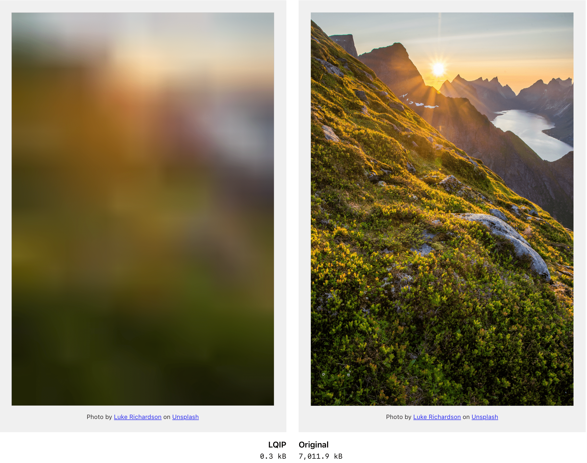

# 📺 vite-plugin-lqip

Low-quality image placeholder (LQIP) generator for [Vite](https://vitejs.dev/). Works in React, Preact, Svelte, SvelteKit, Vue, Astro, or any setup that uses Vite underneath.

- ✅ Inlines images for instant loading
- ✅ Reduce layout shift by having the placeholders rendered on first paint and sized proportionally
- ✅ Uses the [SVG “Blur Up” technique](https://css-tricks.com/the-blur-up-technique-for-loading-background-images/) for gorgeous quality (better than CSS blur)
- ✅ Compatible with [vite-imagetools](https://github.com/JonasKruckenberg/imagetools)



**[View Demo](https://vite-plugin-lqip.pages.dev)**

## Setup

First install the package:

```
npm i -D vite-plugin-lqip
```

Then add to your `vite.config.js`:

```js
import lqip from 'vite-plugin-lqip';

export default {
  plugins: [lqip()],
};
```

### TypeScript

If using TypeScript, place the following in your `globals.d.ts` file:

```ts
declare module '*?lqip' {
  const lqip: {
    lqip: string;
    width: number;
    height: number;
    src: string;
  };
  export default lqip;
}
```

## Usage

### Basic

Use this by adding `?lqip` to the end of any URL. It will then return an object with:

```ts
{
  /** base-64-encoded image to be inlined (< 1kB, more performant than an extra network request) */
  lqip: string;
  /** original src location (provided by Vite; respects your settings) */
  src: string;
  /** width, in pixels, of full-size image */
  width: number;
  /** height, in pixels, of full-size image */
  height: number;
}
```

You can then use this in nearly any Vite-powered app:

```tsx
import lqip from './path/to/image.jpg?lqip';

;
```

> 💡 Tip: set `width` and `height` on images [to prevent layout shifts](https://www.smashingmagazine.com/2020/03/setting-height-width-images-important-again/)

### With vite-imagetools

This plugin is fully compatible with [vite-imagetools](https://github.com/JonasKruckenberg/imagetools). Just use it as you would normally, using the LQIP for the inlined placeholder:

```tsx
import lqip from './path/to/image.jpg?lqip';
import srcSet from './path/to/image.jpg?w=500;700;900;1200&format=webp&as=srcset';

<picture>
  <source srcset={srcset} type="image/webp" />
  
</picture>;
```

## Config

### Plugin Options

Plugin options can be configured in `vite.config.ts`. Here are all plugin options, along with their defaults:

```js
import lqip from 'vite-plugin-lqip';

export default {
  plugins: [
    lqip({
      lqip: {
        /** Height of LQIP (⚠️ the higher the number, the slower the page load!) */
        height: 32,
        /** Width of LQIP (⚠️ the higher the number, the slower the page load!) */
        width: 32,
      },
    }),
  ],
};
```

## Other / Misc

### Compression

It’s worth noting that the LQIP doesn’t undergo additional compression after sharp. In my testing, I found that at small sizes, compression is negligible and in some cases actually **INCREASED** the size from what sharp output. So because compression functionally does nothing, it’s skipped in this plugin.

However, you probably should compress your fullsize images.
